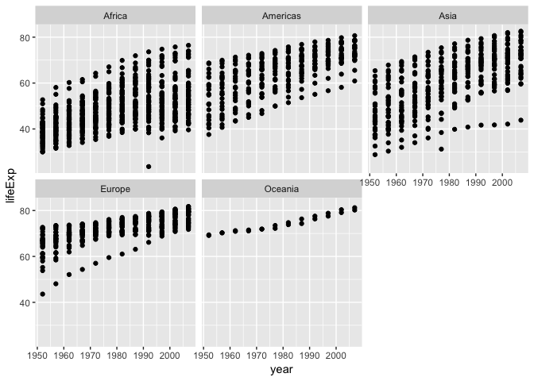
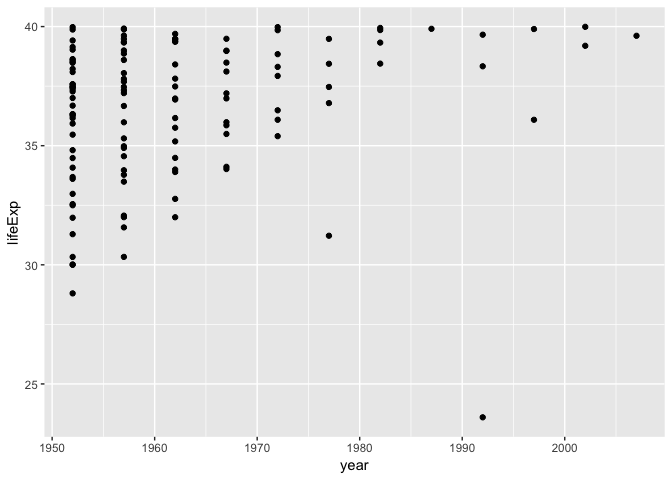
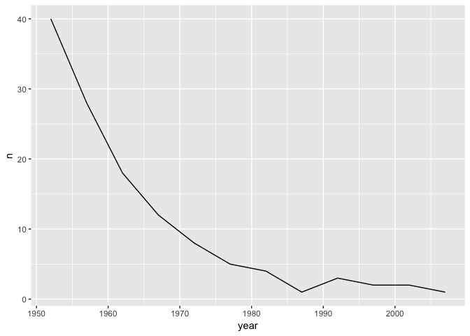

hw03
================

``` r
suppressPackageStartupMessages(require(gapminder))
head(gapminder)
```

    ## # A tibble: 6 x 6
    ##   country     continent  year lifeExp      pop gdpPercap
    ##   <fct>       <fct>     <int>   <dbl>    <int>     <dbl>
    ## 1 Afghanistan Asia       1952    28.8  8425333      779.
    ## 2 Afghanistan Asia       1957    30.3  9240934      821.
    ## 3 Afghanistan Asia       1962    32.0 10267083      853.
    ## 4 Afghanistan Asia       1967    34.0 11537966      836.
    ## 5 Afghanistan Asia       1972    36.1 13079460      740.
    ## 6 Afghanistan Asia       1977    38.4 14880372      786.

Maximum gpd per capita for all continents

``` r
range(gapminder$gdpPercap)
```

    ## [1]    241.1659 113523.1329

Spread of gdp per capita within continents

``` r
suppressPackageStartupMessages(require(tidyverse))
suppressPackageStartupMessages(require(dplyr))
for (cont in unique(gapminder$continent)) {
  print(paste(cont," has min and max",toString(range(filter(gapminder,continent==cont)$gdpPercap))))
}
```

    ## [1] "Asia  has min and max 331, 113523.1329"
    ## [1] "Europe  has min and max 973.5331948, 49357.19017"
    ## [1] "Africa  has min and max 241.1658765, 21951.21176"
    ## [1] "Americas  has min and max 1201.637154, 42951.65309"
    ## [1] "Oceania  has min and max 10039.59564, 34435.36744"

Life Expectancy weighted by population

``` r
print(paste("lifeExp weigthed by pop is",mean(gapminder$lifeExp*gapminder$pop)))
```

    ## [1] "lifeExp weigthed by pop is 1849533478.22246"

Mean lifeExp at 1995 is

``` r
print(paste("mean lifeExp in 1952 is",mean(filter(gapminder,year==1952)$lifeExp)))
```

    ## [1] "mean lifeExp in 1952 is 49.0576197183099"

Change of lifeExp over years for each continent

``` r
yvsl = ggplot(gapminder, aes(year,lifeExp))
yvsl + geom_point() + facet_wrap(~continent)
```

 Scatterplot of countries with low lifeExp. By low lifeExp I mean lifeExp &lt; 40

``` r
CUT_OFF = 40
gapminder %>% 
  filter(lifeExp < CUT_OFF) %>% 
  ggplot(aes(year, lifeExp)) + geom_point()
```

 Count exact number of such countires. Clearly it is decreasing.

``` r
gapminder %>%
  filter(lifeExp < CUT_OFF) %>%
  group_by(year) %>%
  tally() %>% 
  ggplot(aes(x = year, y = n)) + geom_line()
```



Story: Find out the count countries when gdp drops sharply, and visualize by year. Search what happened in those years. For example, was there a war at that time?
